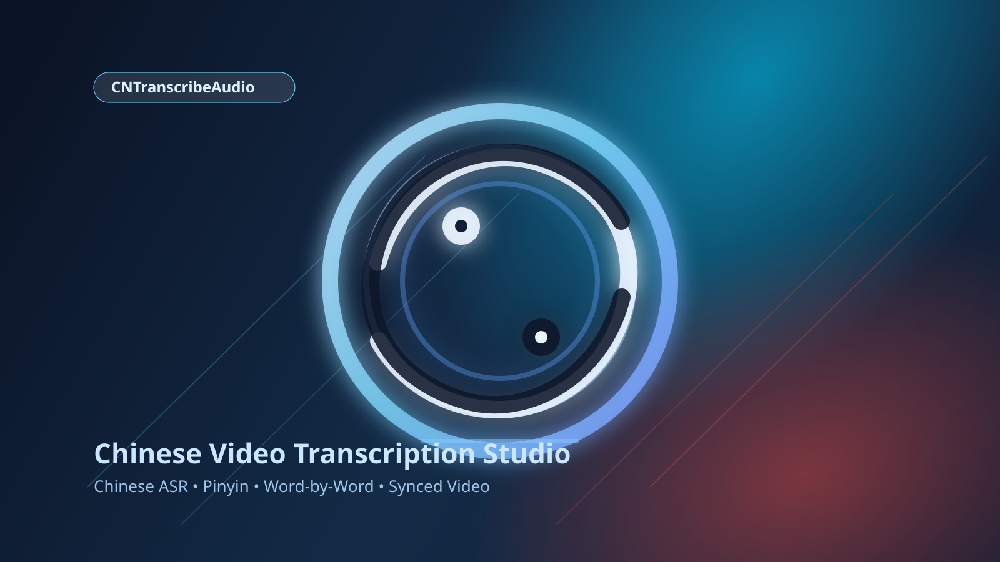

# CNTranscribeAudio



Browser app to transcribe Chinese speech from a YouTube URL and display:
- Chinese transcript with timestamps
- Word-level Chinese + pinyin + English gloss
- Fluent English translation
- Synced playback (YouTube player + auto-highlighted transcript)

## Install

```bash
uv python install 3.10
uv venv --python 3.10
uv sync
```

Notes:
- ASR uses `Qwen/Qwen3-ASR-1.7B` with `Qwen/Qwen3-ForcedAligner-0.6B` for timestamped output.
- On Apple Silicon, check **Use MLX-LM for translation** in the UI to run translation locally with `mlx-lm`.
- Optional ASR model override:

```bash
export CNTRANSCRIBE_ASR_MODEL=Qwen/Qwen3-ASR-1.7B
export CNTRANSCRIBE_QWEN_ALIGNER=Qwen/Qwen3-ForcedAligner-0.6B
```

- Optional MLX translation model override:

```bash
# Default:
export CNTRANSCRIBE_MLX_MODEL=mlx-community/Qwen3-4B-Instruct-2507-8bit
# Alternatives:
# export CNTRANSCRIBE_MLX_MODEL=mlx-community/Qwen3-1.7B-4bit
# export CNTRANSCRIBE_MLX_MODEL=mlx-community/Qwen3-4B-8bit
```

## Run

```bash
uv run main.py
```

Open [http://127.0.0.1:8011](http://127.0.0.1:8011) (default in this project).

The URL input is pre-filled with:
`https://www.youtube.com/watch?v=KuJQn6eeKD0&t=365s`

## API

`POST /api/transcribe/start` then poll `GET /api/transcribe/{job_id}` for progress/result.

```json
{
  "youtube_url": "https://www.youtube.com/watch?v=KuJQn6eeKD0&t=365s",
  "translation_backend": "hf"
}
```

`translation_backend` can be `hf` or `mlx`.
